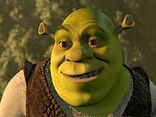
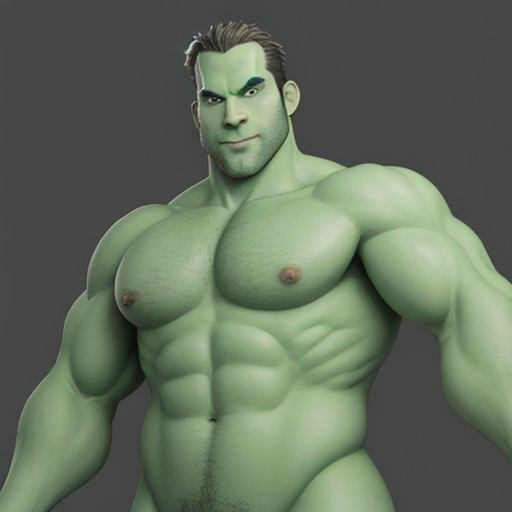
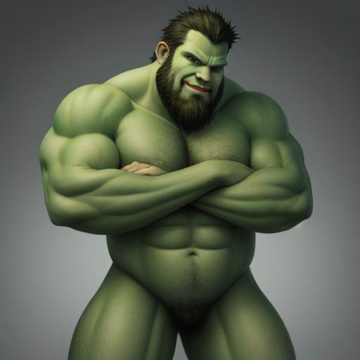
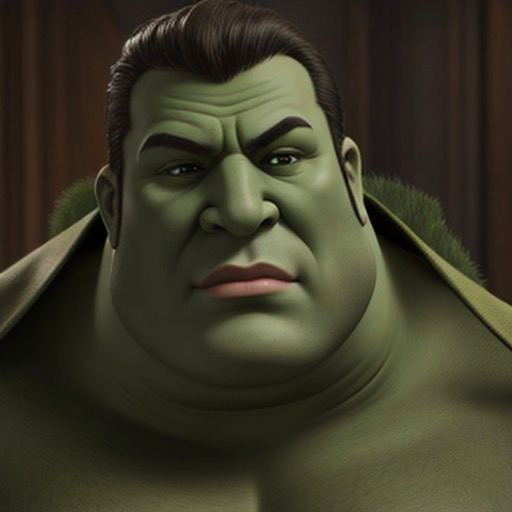

# insomnia.land-mixer 

Insomnia. Mixer of input images. 

1. Give mixer assumptions and URLs
2. Fine-tune start prompt embedding to be closer to all of your images.

This code is based on diffusers and Stable Diffusion models

To run:
1. pip install -r requirements.txt
2. python mixer.py url_1 url_2

## Our results

### Input image 1

### + Input image 2

### = Output images

